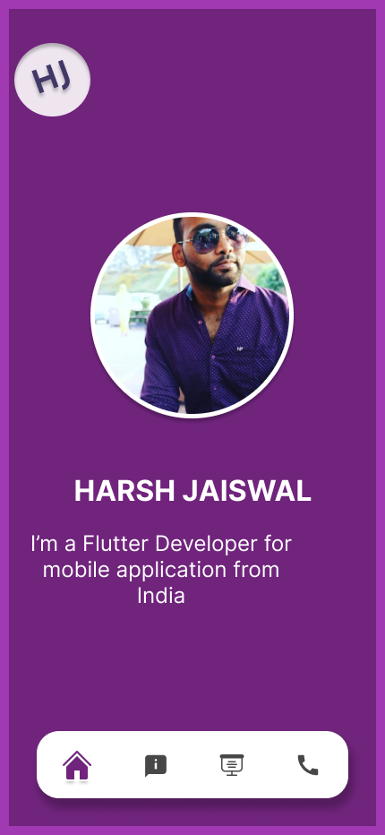
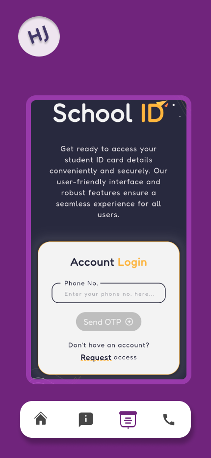
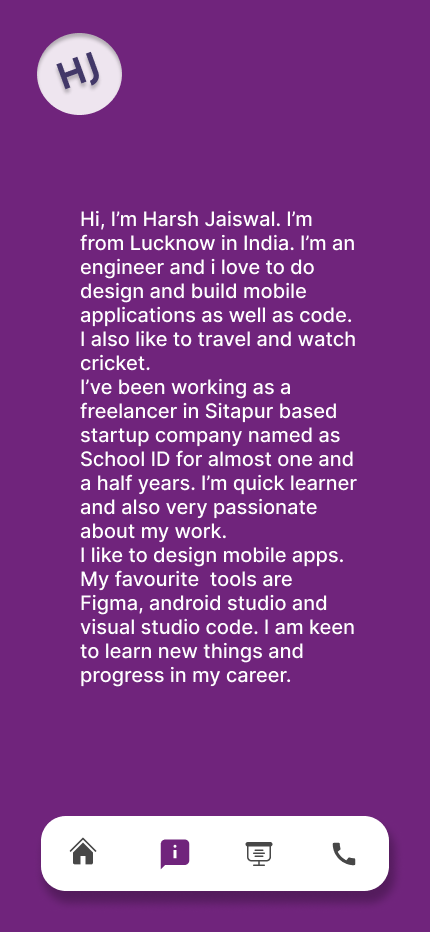
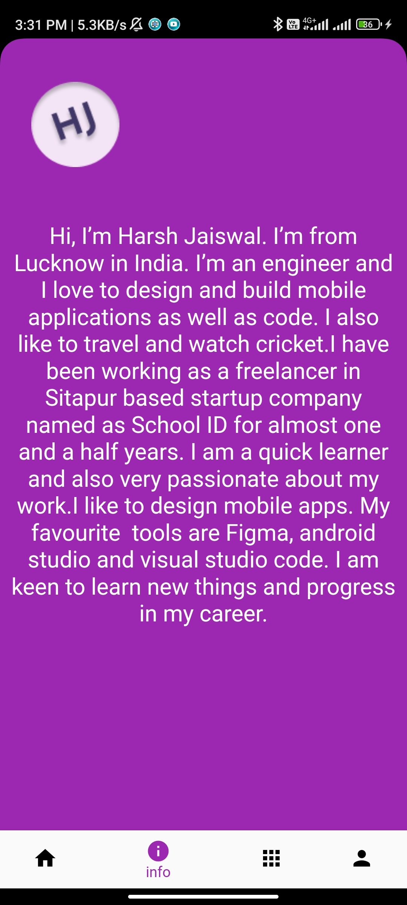
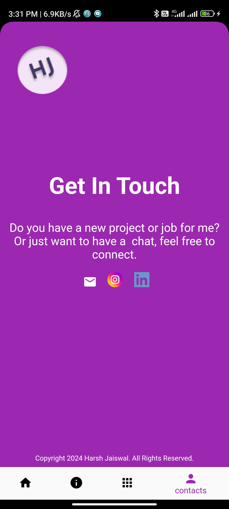

# My Flutter Portfolio App

Welcome to my Flutter portfolio app! This application showcases my skills and projects developed using Flutter, a versatile framework for building cross-platform mobile applications.

## Features

### 1. Projects Showcase

Explore a collection of projects I have developed using Flutter. Each project comes with a brief description and a link to its repository or demo.

### 2. PersonalInfo

Learn more about me, my background, skills, and interests. This section provides a comprehensive overview of who I am as a developer.

### 3. Contact Information

Connect with me through various channels such as email, LinkedIn, GitHub, etc. Reach out to discuss collaboration opportunities, project ideas, or just to say hello!

### 4. Responsive Design

The app is designed to adapt to different screen sizes, ensuring a consistent and optimal user experience across various devices.

### 5. Flutter Packages

Utilizes various Flutter packages for enhanced functionality and UI components, ensuring a polished and professional appearance.

## Screenshots

  

## Technologies Used

- Flutter
- Dart
- Flutter packages (e.g., provider, http, url_launcher)
- Git/GitHub

## Feedback

I welcome any feedback or suggestions for improving this portfolio app. Feel free to create an issue or submit a pull request if you have any ideas for enhancements.

## License

This project is licensed under the [MIT License](LICENSE).

